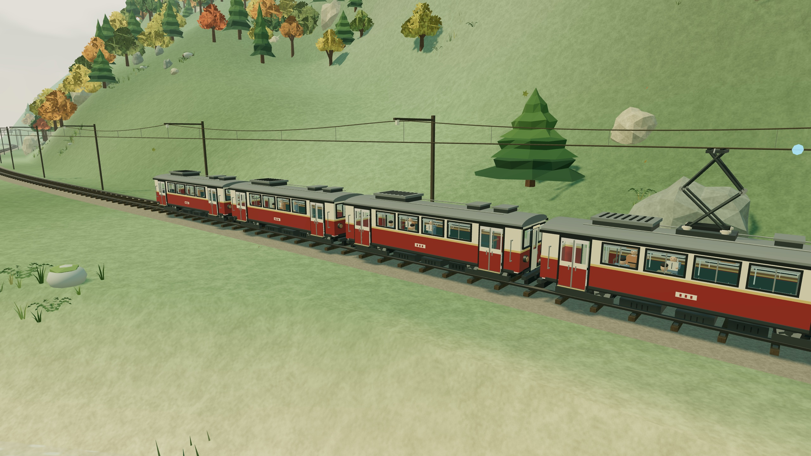
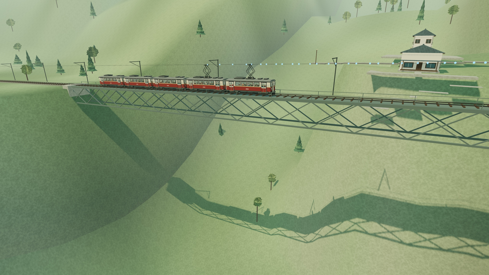
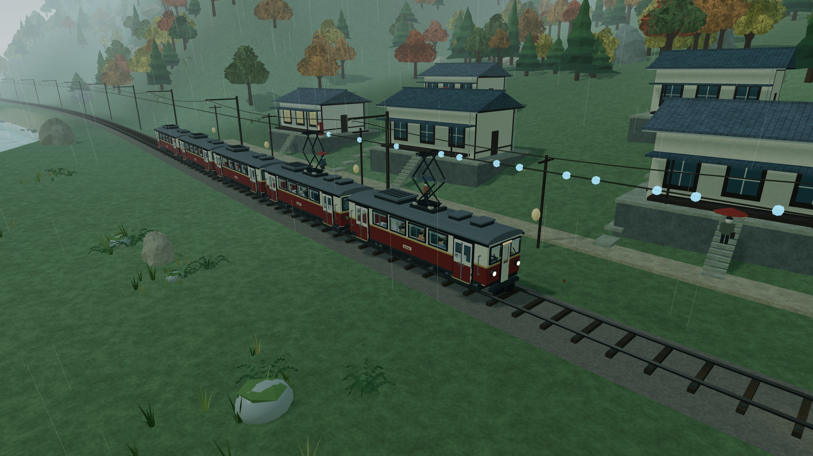
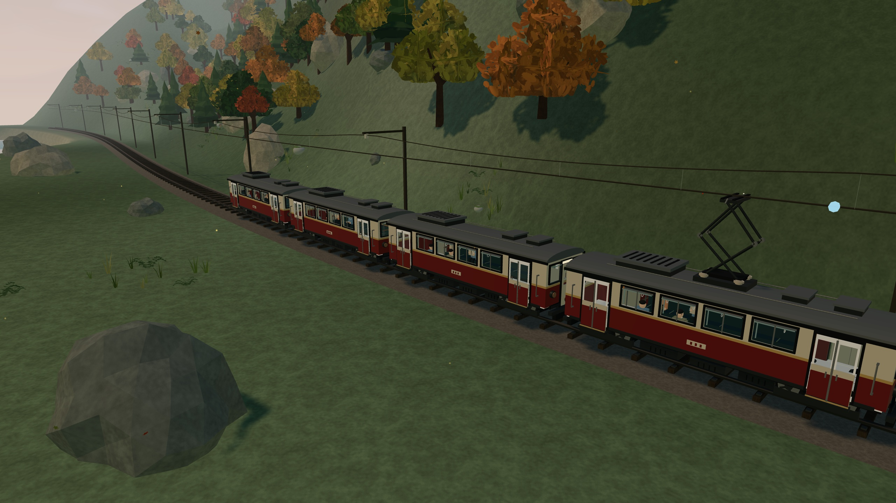
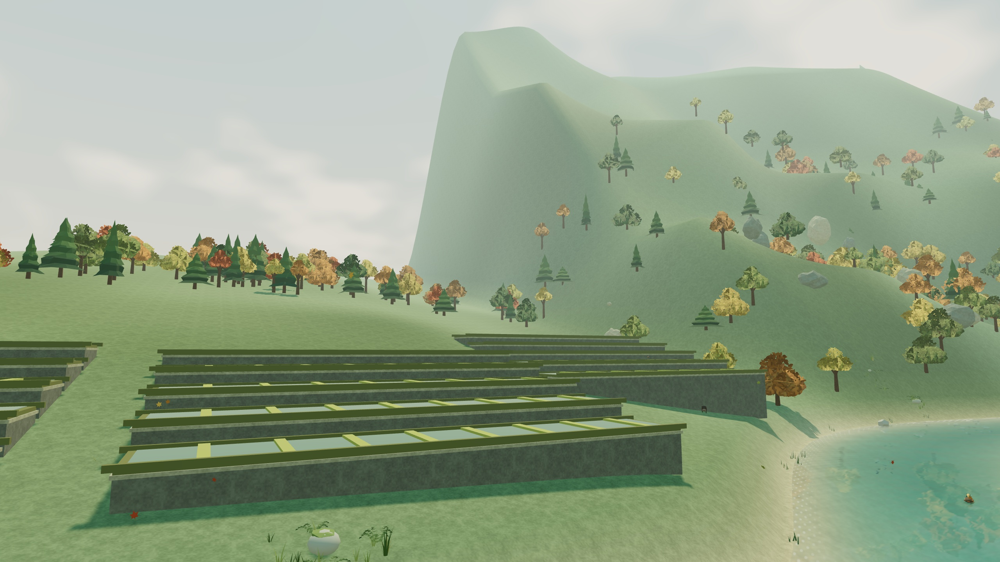
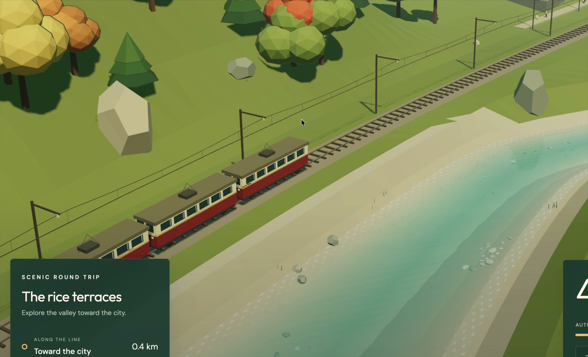
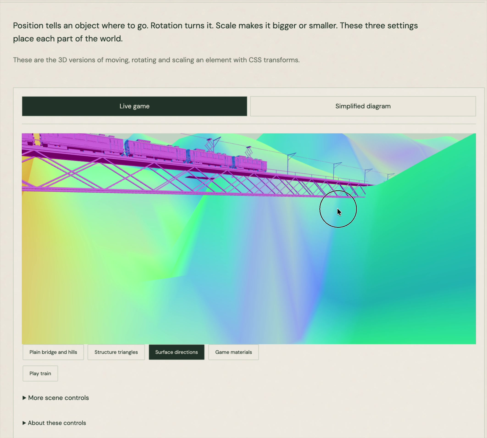

# Maple Line

A local train through a made-up Japanese countryside.

[Play](https://lokeshinumpudi.com/maple-line/) · [Field guide](https://lokeshinumpudi.com/maple-line-runbook/)

| | |
| --- | --- |
|  |  |
|  |  |

Built by [Loki](https://lokeshinumpudi.com).

Run it locally with `pnpm dev`. The full notes are in [docs/GAME.md](docs/GAME.md).
