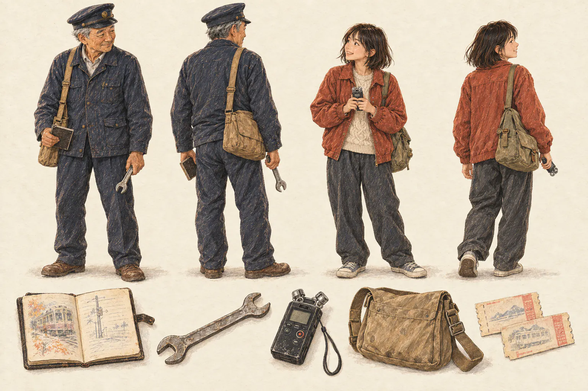

# Haru and Emi

The approved illustration is the visual reference: a navy work jacket and railway cap for Haru, a rust jacket and cream knit for Emi, worn useful possessions, and faces that show attention to each other. The current Three.js figures translate these features into small procedural models. They do not reproduce the illustration’s painted fabric, expressive faces, or seated pose.

## Haru Morita

Haru is sixty and still a working driver. He is proud of knowing the line, embarrassed by things he has postponed, and quick enough to enjoy a joke at his own expense. Experience appears in how he checks equipment and holds a useful tool, not in exaggerated frailty.

His implemented model is about 1.65 metres tall. The navy jacket has a collar, shirt opening, button row, two flap pockets, and narrow seam details. His dark cap has a brim, band, and small brass-coloured badge. Grey side hair, brows, eyes, cheeks, nose, jaw, mouth, and restrained wrinkle marks distinguish his face. He carries a tan shoulder bag with strap, flap, and buckle.

He holds an open brown notebook with cream pages and short ink lines. Before the Aonuma task, he also holds the spanner being returned to Fumi. Completing the task removes it from his hand and places it on the workbench. These props are mesh geometry rather than a portrait texture.

Small head turns and wrist movement accompany a three-millimetre breathing motion. His feet stay planted. The movements suggest someone listening; they do not simulate speaking, locomotion, or an interaction with another character.

Planned actions include checking his pocket watch against the departure board, offering the spanner to Fumi, opening the notebook to a concert programme, lowering it when Emi speaks, carrying a crate, and putting a kettle on at home. None of those complete actions is implemented by the current pose animation.

## Emi

Emi is seventeen. She enjoys her grandfather’s company without accepting every opinion he offers. She records people because she is interested in their voices, not because she has been assigned to preserve an old man’s memories. Her application to study sound is her own decision.

Her implemented model is about 1.5 metres tall. A rust jacket sits over a ribbed cream shirt front, with pockets, collar, cuffs, seams, and buttons. Her dark bob has a back section and separate fringe shapes. She carries an olive bag and holds a small black recorder, with a display, two microphones, buttons, and a record indicator.

The recorder and hands share the same small wrist gesture. Her head and breathing have a different phase from Haru’s so they do not move in unison. Current animation is deliberate and slow, with no bouncing idle loop.

Planned actions include asking permission before recording, checking a sound through headphones, turning the recorder toward a speaker, marking a cut in her notes, handing Haru a rice ball, and making room for a passenger’s box. The current model does not provide facial speech animation or a complete hand skeleton.

## Staging and camera contract

`createStoryCast({ THREE, scene, railPoint, terrainHeight })` creates the models once. `update({ storyState, trainPosition, trainSpeed, dt, elapsed })` shows them only during a supported active conversation while the train is stopped nearby. Supply train speed in metres per second. Supply either elapsed seconds or frame delta seconds for pose animation; rendering the pose is limited to thirty updates per second.

Thirteen station scenes use the actual platform deck, 0.6 metres above the local rail reference, on the platform side 6.55 metres from the track. The first two scenes may use the flat trackside shoulder at route Z -440 and -120, at the measured ground height. Trackside staging requires a nearly flat footprint and a plausible height relative to the track. It does not create an imaginary platform. Unsafe slopes, missing terrain samples, moving trains, and distant trains hide the figures. The bridge and tunnel scenes still do not stage people outside the train.

`getState()` reports visibility and its reason, each character’s feet, head focus and facing direction, a shared `focusPoint`, stage type, active props, pose time, instance count, and rendering batch count. The host camera can frame their faces from those points. The cast module itself never changes the camera.

Both models share three instanced rendering batches and one material. Their details use three reused geometry shapes. Material colour distinguishes navy cloth, rust cloth, leather, skin, paper, and metal; separate woven-fabric normal maps, metallic shading, and weather-dependent wetness remain future work.

The tests cover safe platform placement, actual regional terrain, trackside staging, moving-train suppression, exclusions, bounded pose motion, fixed feet, resource disposal, and the rendering batch budget. These tests do not establish that the figures match the illustration’s artistic quality; that requires close camera review and further character work.

## Village residents

Five residents now appear in their stopped story scenes: Nao at Momiji with a bakery apron and bread crate; Jun at Sakuragawa with a field hat and muddy boots; Mr. Endo at Kawasemi holding a folded private letter; Fumi at Aonuma with a work jacket, grease rag and repair bench; and Mika at Yukihara with a scarf, café apron and cup. These are procedural figures with distinct colours, hair, clothes and props. They share three rendering batches and appear only in the relevant conversation.

`story-guests.js` reports their feet and head positions to the conversation camera. Their feet remain fixed while a two-millimetre breathing motion moves the upper body. They do not yet walk through a full daily schedule or animate speech. Haru and Emi retain their separate three batches.
