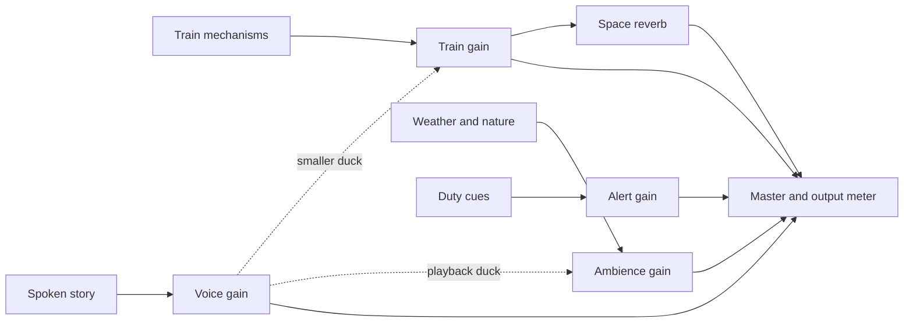

# Sound engineering recipes

These are proposed Maple Line experiments unless labelled **current**. Numerical tuning ranges below are starting points chosen for this game, not standards or measured train acoustics. See the [implementation audit](../SOUND-RESEARCH.md) before editing and the [reading record](sources.md) for source scope.

## Train identity and control signals

Use a hybrid of recordings and synthesis. Keep synthesis for fast, continuous control and failure fallback; use edited recordings for irregular physical texture. Start with an electric commuter identity. Steam chuffs, diesel idle and an unrelated branded departure melody are poor substitutes for missing material.

| Layer           | Control                                                                 | Proposed treatment                                                                                                      | Avoid                                                                                                |
| --------------- | ----------------------------------------------------------------------- | ----------------------------------------------------------------------------------------------------------------------- | ---------------------------------------------------------------------------------------------------- |
| Rolling body    | Absolute speed, track material, cab/exterior                            | Two or three matched speed bands, quiet interior rattle, smooth equal-power crossfade where recordings are uncorrelated | Stretching an entire departure recording to cover all speeds                                         |
| Traction        | Actual power, speed, coasting and regenerative-brake state if available | Separate low motor body and restrained harmonic/whine layer; reduce drive tone while coasting                           | Driving all motor amplitude solely from speed or inventing inverter modes for an unknown train       |
| Axles/joints    | Distance crossings, bogie positions, travel direction                   | Short variations, tight scheduling, shared sample buffers; distinct bridge resonances                                   | Timer-driven clacks at rest, fixed rhythm at all speeds, continuous joint rhythm on every track type |
| Brakes          | Brake effort, speed and transition edges                                | Air-release events and modest friction texture; reserve a sharper cue for emergency state                               | A long squeal at every ordinary stop or every frame while the brake is held                          |
| Doors           | Opening/closing motion and end stops                                    | Mechanism start/body/end; choose a matching source after removing unrelated beeps                                       | Playing the complete 8-second source when a game door takes less time                                |
| Horn            | Explicit duty/game action                                               | Brief, consistent cue with bounded gain                                                                                 | Random horn events or treating a distant horn as a dry close recording                               |
| Wipers          | Actual swipe phase                                                      | Rubber/contact events near each stroke; rain bed independent of wiper speed                                             | A free-running audio timer drifting from the visible blade                                           |
| Passing service | Other train's position and relative motion                              | Moving mono source or authored pass-by selected to match the scene                                                      | Applying fresh Doppler to a recording whose pitch and distance already change                        |

Current rail spacing is a designed 12 m rhythm with three cars and four axle offsets per car. It is not a claim about real track construction. The collected train interior has unknown speed and an open window, so it is a reference for texture until usable steady sections are selected. A measured train recording campaign should capture idle, low/mid/high constant speeds, power-off coasting, normal braking, doors and horn from consistent interior/exterior positions.

Railway research supports wheel/rail excitation as a distinct source of rolling noise. It does not prescribe these game layers or gain curves. [RTRI paper, abstract and published scope](https://www.jstage.jst.go.jp/article/rtriqr/50/1/50_1_32/_article).

## Timing and transitions

Current control updates arrive approximately every 40 ms from the render loop. Continuous gain/filter targets can tolerate this with smoothing; tightly spaced axle events should carry an audio timestamp. For an interval with distance `d0 → d1` and a joint at `dj`, the crossing fraction is `(dj − d0) / (d1 − d0)`. Reject a discontinuity before using that fraction. A delayed callback cannot schedule sound in the past: either delay the presentation by a small known buffer or predict the next crossings from speed. Make that tradeoff explicit.

Prototype a scheduler that wakes every 25 ms with roughly 80–100 ms of lookahead. Keep cancellation handles for queued impacts. A new brake, reverse, teleport, mute or resume must invalidate future predictions. Test 100–250 ms main-thread stalls; do not promise that a 100 ms horizon survives a longer stall. The browser's audio clock provides scheduled playback timing; JavaScript timers only replenish the queue. [Web audio scheduling](https://web.dev/articles/audio-scheduling).

Each `AudioBufferSourceNode` is single-use; reuse its decoded buffer, create a new source for each event, and release event nodes after ending. [MDN source-node lifecycle](https://developer.mozilla.org/en-US/docs/Web/API/AudioBufferSourceNode).

Current `setTargetAtTime` values are exponential time constants. A 0.12 s value reaches about 95% of the change in 0.36 s; it is not a 120 ms completed fade. For exact silence, ramp to zero or explicitly set zero after the fade. Start speech ducking on actual playback rather than on a network request. Avoid repeated automation resets every update. [MDN target automation](https://developer.mozilla.org/en-US/docs/Web/API/AudioParam/setTargetAtTime).

## Listening position, distance and shelter

Make listener policy explicit for each camera. Cab: anchor to the occupied leading cab. Follow: camera position can supply direction, with a restrained train presence chosen intentionally. Scenic: camera-distance attenuation is appropriate; cap the far-field train floor if it masks nearby nature. During a cinematic cut, crossfade perspective instead of deriving an enormous listener velocity.

Keep stereo beds for diffuse surroundings. Use mono sources for a specific door, person, bird or bogie. `StereoPannerNode` gives left/right balance; it does not model occlusion, elevation or front/back. A selective HRTF prototype should start with only a few nearby emitters. Listen in mono as well as stereo; phase cancellation can remove detail even if the stereo mix seems full. This is a project design based on the distinction between panning and spatial rendering described by [FMOD](https://www.fmod.com/docs/2.03/studio/advanced-topics.html#spatialization-options).

Treat attenuation as an authored function of distance, with a near zone, falloff and far cutoff. Use one owner for distance gain to avoid attenuating twice when introducing `PannerNode`. Filter and wet/dry balance can reinforce distance without merely making every distant sound inaudible. [Audiokinetic attenuation documentation](https://www.audiokinetic.com/library/2019.2.0_7216/?id=applying_distance_based_attenuation&source=Help) supplies the concept; its 2019.2 API is not an implementation dependency.

Use a nearest point on each river segment, not one source at the river centre or the current original-valley clamp. Crossfade between adjacent segments and cap the combined bed so a segment boundary does not double loudness. Select nearby pedestrian groups from activity, occupancy and distance. The number of voices should correspond loosely to the group size; a hundred-person crowd cannot represent two people chatting close to the cab.

For tunnel portals, separate whether the listener is sheltered from whether the source is inside. Ramp exterior transmission, high-frequency loss and wet send over a short portal region. Keep some direct train sound. A tunnel impulse response models a space; a long generic tail on every sound does not. The current random 1.8-second convolver is an approximation, not a measured tunnel. Room/portal and transmission concepts come from the [Audiokinetic overview](https://www.audiokinetic.com/en/library/edge/?id=spatial_audio_roomsportals_apioverview.html&source=SDK), available here through indexed documentation excerpts; no Wwise integration has been tested.

## Environmental composition

Use a quiet continuous bed plus sparse local details. Let the station approach, bridge opening, forest edge and snowy summit have different densities. Avoid keeping every layer at its maximum just because its associated object exists somewhere on the map.

- **Forest:** leaf/branch movement follows wind exposure. Bird calls need species/season review and pauses. The existing Australian recording is general texture; do not associate it with a specific Japanese bird in the wildlife guide.
- **Summer:** the collected Tokyo park cicadas can replace or augment the current simple insect tone after audition. Gate by season, region and weather; the recordist's evening recording is not proof that all cicadas sing only at dusk. Keep the high-frequency chorus below dialogue.
- **Water:** use broad rush at distance and a quieter close-detail layer near a stream, with reduced high-frequency detail behind terrain. Do not add bubbling to every body of water.
- **Rain:** split outdoor wash from impacts on leaves, roof, glass and puddles. Cab roof/glass audio remains local when the exterior is muffled. The car-interior candidates are material references, not exact train acoustics. A tunnel should remove direct roof rain gradually.
- **Snow:** soften selected outdoor texture and reduce activity; retain wind where exposed. Use crust crunch only for movement on crusted snow. Fresh and refrozen snow have different acoustic behavior. [NSIDC](https://nsidc.org/learn/parts-cryosphere/snow/science-snow).
- **People:** keep narration and intelligible dialogue separate from distant group murmur. The French crowd candidate is marked reference-only for cultural fit; a low-pass filter does not guarantee words become unintelligible or resolve recording rights.

Use shuffled variation sets, a no-immediate-repeat rule and small gain differences for discrete textures. Pitch variation of a few percent may help footsteps; do not change a bird's pitch to claim a different species. Prefer separate independent recordings over playing duplicated loops with slightly different pitch, which can introduce comb filtering and obvious drift.

## Editing loops and events

Keep acquired files untouched. Auditions are short trims with constant gain and edge fades; they are not finished loops. The manifest records every edit. Start edits from a lossless original when available; the collected public previews cannot become lossless through re-encoding.

For a bed, select a stable segment without prominent speech, passing vehicles or singular bird phrases. Compare head/tail spectral balance and energy. Overlap in decoded PCM; equal-power fades suit uncorrelated segments but can swell when signals correlate. Use linear or adjusted curves where appropriate and listen to at least ten seams. A zero sample discontinuity alone cannot establish a natural loop. Document loop sample positions and check the encoded playback as well as the working WAV.

For an event, preserve onset and decay, remove unnecessary silence, fade only enough to avoid a discontinuity, and retain variations with different natural attacks. Keep door or footstep sequences intact as references until their individual actions are located. Do not cut blindly at a loudness peak and call it an isolated sound.

The existing `blendLoop` performs one equal-power PCM overlap on load. Re-running it on an already prepared loop changes the edit again; decide which stage owns the seam. Test channels independently, then stereo and mono. [Web Audio loop model](https://www.w3.org/TR/2021/REC-webaudio-20210617/#looping-AudioBufferSourceNode).

## Mixing and loudness

Proposed routing:

This graph is a proposal. Current narration uses separate playback and only emits a ducking event to the environment. Do not describe it as already travelling through this graph.

Choose dialogue as the reference, lower competing midrange layers, and preserve quiet intervals. Try ambience ducking of 8–12 dB and a smaller 3–6 dB train reduction; keep gameplay alerts readable without making them louder than necessary. Current master duck is `0.28`, about −11.1 dB, and affects all soundscape layers equally. Compare fast speech onset and a slower recovery; narration pauses should intentionally return the environment, especially during the authored listening scene.

Use LUFS for identified captures, true peak for reconstructed peaks, and a spectrogram to find persistent narrow-band whine. RMS and sample peak alone cannot show speech masking. EBU R 128 specifies −23 LUFS for its broadcast programme context; that is not a mandatory target for a browser game or individual sound asset. [EBU recommendation](https://tech.ebu.ch/publications/r128).

For Maple auditions, a −24 LUFS reference with a −4 dBTP peak guard is a collection convenience. For a proposed full-game capture, compare approximately −24 to −20 LUFS at the chosen default volume and keep at least 2 dB of true-peak headroom during worst-case overlaps. These are tuning proposals, not guarantees or a claim about safe acoustic playback levels. Device volume and headphones remain outside the file's LUFS measurement.

Use constant gain when possible so natural dynamics survive. The collection's preparation caps upward gain at 12 dB and respects peak headroom; some previews therefore remain below −24 LUFS. Re-measure the encoded preview. `loudnorm` supports measurement and normalization; `ebur128` reports loudness descriptors. Explicitly set output sample rate when processing with loudnorm. [FFmpeg filters](https://ffmpeg.org/ffmpeg-filters.html#loudnorm).

Provide separate voice/effects/ambience controls and a mono option within existing Options when implementing the next mix. Retain visual door, signal and duty information so audio is not the only cue. These remain planned controls. [Xbox audio options](https://learn.microsoft.com/en-us/xbox/accessibility/xbox-accessibility-guidelines/105) and [text alternatives](https://learn.microsoft.com/en-us/xbox/accessibility/xbox-accessibility-guidelines/102).

## Runtime cost and failure behavior

Keep short events in shared decoded buffers; load only the active and approaching region's required beds. At 48 kHz a 30-second stereo float buffer is 11.52 MB; an overlap editor may temporarily hold both input and output. Include narrator cache memory and convolver buffers when measuring a page. MP3 transfer bytes are a separate budget. [AudioBuffer](https://www.w3.org/TR/2021/REC-webaudio-20210617/#AudioBuffer).

Start with a proposed ambient-buffer budget around 32 MB and at most 4–6 audible beds per region, then measure actual overlap cost. Retain important alerts when the transient cap is reached by dropping the least audible optional detail. Track loop phase when suspending an inaudible emitter so it does not restart recognizably at each boundary. These are adaptations of voice-priority/virtualization concepts, not an assertion that muting a Web Audio gain saves processing. [FMOD instance limits and virtualization](https://www.fmod.com/docs/2.03/studio/advanced-topics.html#stealing-and-virtualization).

Continue creating/resuming audio from the player's Sound action, handling rejected resume/play and decoding failures. Cache successful loads, retry failed ones deliberately, and avoid a network request from every frame. [Chrome autoplay policy](https://developer.chrome.com/blog/autoplay/) and [MDN best practices](https://developer.mozilla.org/en-US/docs/Web/API/Web_Audio_API/Best_practices).

Prefer native audio nodes for the present graph. Consider an AudioWorklet only after measured scheduling or DSP limits justify it. Avoid allocations, fetching and unbounded work on the audio render thread; buffer size adaptation does not increase processing time available. The Chrome article uses the historic 128-frame block model; inspect actual output array lengths in new code rather than treating it as a permanent API constant. [AudioWorklet design patterns](https://developer.chrome.com/blog/audio-worklet-design-pattern/).

## Verification

| Scenario                                  | Check by listening                                 | Check by measurement or state                                           |
| ----------------------------------------- | -------------------------------------------------- | ----------------------------------------------------------------------- |
| First load; Sound off/on                  | No unsolicited sound or repeated start clicks      | No recording downloads before activation; one successful load per asset |
| Idle → power → coast → brake              | Distinct motor/rolling balance; no rolling at rest | Rail count follows distance; power and brake transitions match state    |
| Reverse; teleport; delayed frame          | No burst, doubled clack or pitch jump              | Scheduler invalidation and bounded future queue                         |
| Scenic ↔ Follow ↔ Driver                  | Stable perspective transition                      | No camera-cut Doppler spike; finite pan/filter targets                  |
| River bank → bridge → regional river      | Water stays with the scene                         | Correct emitter/segment and boundary gain                               |
| Clear → rain → snow                       | Different materials and activity                   | Correct regional weather; no rain through tunnel roof                   |
| Platform; doors; walkers                  | Mechanism and steps match action                   | No stale loop at empty platform; cadence follows movement               |
| Tunnel entry and exit in both directions  | Plausible change in direct sound and tail          | Separate listener/source shelter and bounded wet gain                   |
| Narration start, gap, cancel, retry       | Words understandable; scenery returns in gaps      | Duck event follows actual speech; no stale response starts audio        |
| Pause, hidden tab, resume, mute, disposal | No burst or lingering tail after defined fade      | Context/state and transient cleanup; no unbounded nodes                 |
| Failed asset request or decode            | Fallback remains coherent                          | Error handled, successful buffers reused, retry bounded                 |
| Headphones, laptop speakers, mono         | No missing cue or tiring whine                     | LUFS/true peak of combined output; phase and channel checks             |

Keep a short fixed state sequence for offline renders and a longer 60–120 second live capture with narration for mix decisions. Log capture duration, sample rate, volume, scene sequence, active voices and browser. Check finite samples, peaks, tail energy after mute and render errors. Offline rendering validates graph output but not realtime glitches, browser autoplay or human intelligibility. Record listening separately; automated decode success does not mean a clip sounds appropriate.
